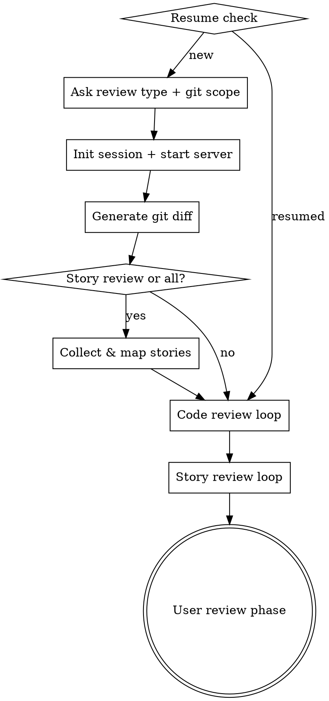
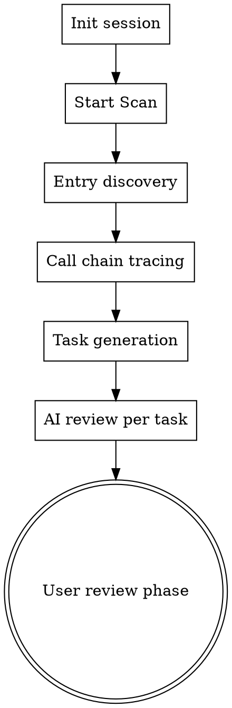

# A-Solid Audit

AI-powered code review and story alignment audit tool.

[中文文档](README.zh-CN.md)

## Features

- **AI Code Review** — automated analysis of correctness, quality, security, error handling, and best practices per file
- **Story Alignment Review** — maps acceptance criteria to actual code changes with coverage evaluation
- **Project Scan** — full project-level scan from entry points (API routes, cron jobs, consumers, scripts), traces call chains with optional [CodeGraph](https://github.com/colbymchenry/codegraph) AST analysis
- **Live Web Report** — report server auto-starts before AI review, watch progress in real-time at `localhost:3456`
- **Human Confirmation & Sign-off** — confirm/dismiss findings with reason selection, add notes, sign off with name and role
- **Provider Plugin System** — extensible story providers (JIRA, Linear, etc.) via scripts in `scripts/providers/`
- **PDF Export** — configurable PDF report with overview, findings, code snippets, and sign-off page
- **Zero Dependencies** — pure Node.js, no external packages
- **Session Recovery** — resume interrupted sessions, reset stuck tasks

## Quick Start

### Prerequisites

- An AI coding assistant CLI installed
- Node.js 18+

### Installation

This project is an AI coding assistant plugin distributed through a marketplace.

**Step 1 — Add the marketplace**

```
/plugin marketplace add a-solid/a-solid-audit
```

Or using the full GitHub URL:

```
/plugin marketplace add https://github.com/a-solid/a-solid-audit.git
```

**Step 2 — Install the plugin**

```
/plugin install a-solid-audit@a-solid-audit-marketplace
```

You can also use the interactive UI: run `/plugin`, go to the **Discover** tab, and select the plugin to install with your preferred scope (User, Project, or Local).

**Step 3 — Reload plugins**

```
/reload-plugins
```

After installation, the `/audit` skill is available in all your projects.

### Usage

1. Open your project in your AI coding assistant:

```bash
cd your-project
claude
```

2. Invoke the audit skill:

```
/audit
```

3. Follow the interactive prompts to:
   - Select review type: **code review**, **story review**, **project scan**, or **both**
   - Specify git scope: **uncommitted changes**, **two commits**, or **branch diff** (for code/story review)
   - For project scan: choose the target project directory

4. AI agents review each file/story sequentially

5. View the live web report:

```
http://localhost:3456
```

## Audit Flow

### Code Review / Story Review



### Project Scan



**How Project Scan works:**

1. **Entry discovery** — scans the project for entry points by heuristic path matching (API handlers, cron jobs, message consumers, CLI scripts) or via [CodeGraph](https://github.com/colbymchenry/codegraph) framework-aware route detection
2. **Call chain tracing** — for each entry point, traces the call chain to all related files (CodeGraph AST analysis when available, regex-based import resolution as fallback)
3. **Task generation** — each entry point + its call chain becomes an independent review task with a Mermaid call chain diagram
4. **AI review** — an AI sub-agent reviews each task for security vulnerabilities, business logic bugs, and code quality issues
5. **User review** — browse findings, confirm or dismiss with reasons, sign off

## Web Report

The report server auto-starts and provides a split-panel interface:

- **Overview** — grade, score, AI review progress, findings breakdown, needs attention cards
- **Summary** — task status table (AI Review + Human Confirm), findings stats, sign-off form
- **Task Detail** — findings grouped by severity, dismiss with reason selection, code snippets, suggestions, positives

### Finding Status Lifecycle

Each finding goes through a review workflow:

```
Pending → Need Fix      (problem confirmed, requires a fix)
Pending → Won't Fix     (accepted, won't address — with reason)
Pending → Not an Issue  (not a real issue — with reason)
```

- **Auto-mark low severity:** navigating to a task automatically marks low-severity findings as Won't Fix with reason "Auto-marked: low severity"
- Any reviewed finding can be reverted to Pending

### Won't Fix Reasons

| Reason | When to use |
|---|---|
| Intentional design | The flagged pattern is a deliberate design choice |
| Acceptable risk | The risk is known and acceptable for now |
| Low priority | Issue is valid but low priority |
| Already addressed | Fix has already been applied elsewhere |

### Not an Issue Reasons

| Reason | When to use |
|---|---|
| AI misunderstood context | The AI misinterpreted the code context |
| Not applicable | Finding does not apply to this codebase |
| Already handled elsewhere | The concern is addressed in a different part of the code |
| Feature, not a bug | The flagged behavior is intentional functionality |

### Summary Page Metrics

| Metric | Meaning |
|---|---|
| Total Findings | Sum of all findings across all tasks |
| Need Fix | Findings with status `need-fix` |
| Won't Fix | Findings with status `wont-fix` |
| Not an Issue | Findings with status `not-an-issue` |
| Pending | Findings with no status set |

### Human Review Status

The task table shows a Human Review column with three states:

| Status | Condition |
|---|---|
| Reviewed | All findings in the task have a status |
| Partial | Some findings have a status |
| Unreviewed | No findings have a status |

### Keyboard Shortcuts

| Key | Action |
|---|---|
| `←` `→` or `J` `K` | Navigate tasks |
| `O` | Overview view |
| `S` | Summary view |
| `?` | Toggle help |

## Skills Overview

| Skill | Description |
|---|---|
| **audit** | Orchestrator — manages session lifecycle, git diff, task delegation, and report server |

The orchestrator uses three internal prompts (not registered as standalone skills):

| Prompt | Description |
|---|---|
| **code-review** | Analyzes per-file diffs against 5 criteria, outputs severity-rated findings and score |
| **story-review** | Evaluates acceptance criteria coverage against code changes |
| **project-review** | Reviews entry-point call chains for security, business logic, and code quality |

## Session Data

Each audit session creates a `.audit/<session-id>/` directory:

```
.audit/
  <session-id>/
    index.yaml              # Session metadata and task list
    code-tasks/
      <path.to.file>.yaml   # Per-file code review task
    story-tasks/
      <story-name>.yaml     # Per-story alignment task
    project-tasks/
      <entry-name>.yaml     # Per-entry-point project scan task
    review-notes.yaml       # User notes, finding confirmations, sign-off
```

### Project Task YAML

Each project scan task contains:

```yaml
name: "user-management"
type: api                         # api | scheduled | consumer | script | unknown
entry: "src/handlers/users.mjs"   # Entry point file
files:                            # All files in the call chain
  - "src/handlers/users.mjs"
  - "src/services/user-service.mjs"
overview:
  diagram: "graph TD\n  ..."      # Mermaid call chain diagram
  description: "HTTP API ..."     # Execution flow description
review:
  score: 7
  findings: [...]
  positives: [...]
```

## Configuration

### CodeGraph (Optional)

[CodeGraph](https://github.com/colbymchenry/codegraph) provides AST-level call chain analysis for more precise project scans. Without it, the scanner uses heuristic import resolution.

Install via the bundled script:

```bash
bash scripts/setup-codegraph.sh
```

Or manually:

```bash
git clone https://github.com/colbymchenry/codegraph.git ~/.local/share/codegraph
cd ~/.local/share/codegraph && npm install && npm run build
npm link
```

### Story Providers

Story providers are executable scripts in `scripts/providers/`. Each receives story IDs as arguments and outputs a JSON array:

```json
[{"id": "...", "name": "...", "description": "...", "acceptance": "..."}]
```

For JIRA integration, set these environment variables:

| Variable | Description |
|---|---|
| `JIRA_BASE_URL` | JIRA instance URL, e.g. `https://your-org.atlassian.net` |
| `JIRA_USER_EMAIL` | Your JIRA account email |
| `JIRA_API_TOKEN` | JIRA API token |

## License

[Apache License 2.0](LICENSE)
