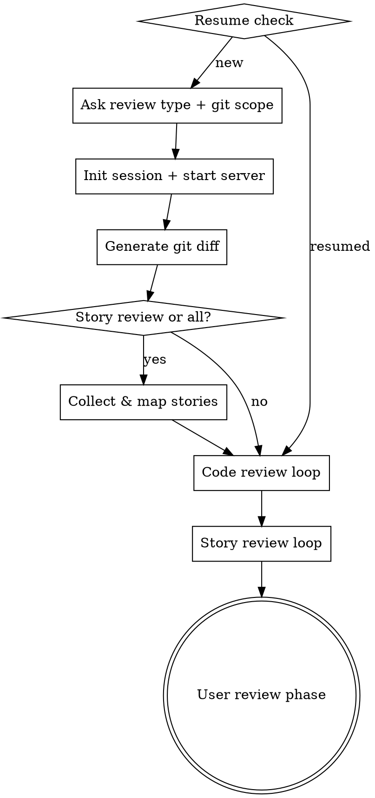

# A-Solid Audit

AI-powered code review and story alignment audit tool.

[中文文档](README.zh-CN.md)

## Features

- **AI Code Review** — automated analysis of correctness, quality, security, error handling, and best practices per file
- **Story Alignment Review** — maps acceptance criteria to actual code changes with coverage evaluation
- **Live Web Report** — report server auto-starts before AI review, watch progress in real-time at `localhost:3456`
- **Human Confirmation & Sign-off** — confirm/dismiss findings with reason selection, add notes, sign off with name and role
- **Provider Plugin System** — extensible story providers (JIRA, Linear, etc.) via scripts in `scripts/providers/`
- **PDF Export** — configurable PDF report with overview, findings, code snippets, and sign-off page
- **Zero Dependencies** — pure Node.js, no external packages
- **Session Recovery** — resume interrupted sessions, reset stuck tasks

## Quick Start

### Prerequisites

- An AI coding assistant CLI installed
- Node.js 18+

### Installation

This project is an AI coding assistant plugin distributed through a marketplace.

**Step 1 — Add the marketplace**

```
/plugin marketplace add a-solid/a-solid-audit
```

Or using the full GitHub URL:

```
/plugin marketplace add https://github.com/a-solid/a-solid-audit.git
```

**Step 2 — Install the plugin**

```
/plugin install a-solid-audit@a-solid-audit-marketplace
```

You can also use the interactive UI: run `/plugin`, go to the **Discover** tab, and select the plugin to install with your preferred scope (User, Project, or Local).

**Step 3 — Reload plugins**

```
/reload-plugins
```

After installation, the `/audit` skill is available in all your projects.

### Usage

1. Open your project in your AI coding assistant:

```bash
cd your-project
claude
```

2. Invoke the audit skill:

```
/audit
```

3. Follow the interactive prompts to:
   - Select review type: **code review**, **story review**, or **both**
   - Specify git scope: **uncommitted changes**, **two commits**, or **branch diff**

4. AI agents review each file/story sequentially

5. View the live web report:

```
http://localhost:3456
```

## Audit Flow



## Web Report

The report server auto-starts and provides a split-panel interface:

- **Overview** — grade, score, AI review progress, findings breakdown, needs attention cards
- **Summary** — task status table (AI Review + Human Confirm), findings stats, sign-off form
- **Task Detail** — findings grouped by severity, dismiss with reason selection, code snippets, suggestions, positives

### Dismiss Reasons

| Code | Story |
|---|---|
| AI false positive | Out of scope |
| Known issue | Known limitation |
| Business exception | Business decision |
| Will fix elsewhere | Will fix elsewhere |
| Acceptable risk | Acceptable risk |

### Keyboard Shortcuts

| Key | Action |
|---|---|
| `←` `→` or `J` `K` | Navigate tasks |
| `O` | Overview view |
| `S` | Summary view |
| `?` | Toggle help |

## Skills Overview

| Skill | Description |
|---|---|
| **audit** | Orchestrator — manages session lifecycle, git diff, task delegation, and report server |

The orchestrator uses two internal prompts (not registered as standalone skills):

| Prompt | Description |
|---|---|
| **code-review** | Analyzes per-file diffs against 5 criteria, outputs severity-rated findings and score |
| **story-review** | Evaluates acceptance criteria coverage against code changes |

## Session Data

Each audit session creates a `.audit/<session-id>/` directory:

```
.audit/
  <session-id>/
    index.yaml              # Session metadata and task list
    code-tasks/
      <path.to.file>.yaml   # Per-file code review task
    story-tasks/
      <story-name>.yaml     # Per-story alignment task
    review-notes.yaml       # User notes, finding confirmations, sign-off
```

## Configuration

### Story Providers

Story providers are executable scripts in `scripts/providers/`. Each receives story IDs as arguments and outputs a JSON array:

```json
[{"id": "...", "name": "...", "description": "...", "acceptance": "..."}]
```

For JIRA integration, set these environment variables:

| Variable | Description |
|---|---|
| `JIRA_BASE_URL` | JIRA instance URL, e.g. `https://your-org.atlassian.net` |
| `JIRA_USER_EMAIL` | Your JIRA account email |
| `JIRA_API_TOKEN` | JIRA API token |

## License

[Apache License 2.0](LICENSE)
