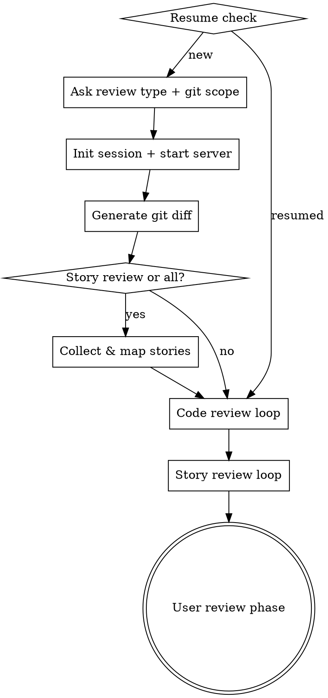

# A-Solid Audit

AI-powered code review and story alignment audit for Claude Code / AI 驱动的代码审查与 Story 对齐审查工具。

## Features / 功能亮点

- **AI Code Review** — automated analysis of correctness, quality, security, error handling, and best practices per file / 按文件自动分析正确性、代码质量、安全性、错误处理和最佳实践
- **Story Alignment Review** — maps acceptance criteria to actual code changes with coverage evaluation / 将验收标准映射到实际代码变更并评估覆盖度
- **Live Web Report** — report server auto-starts before AI review, watch progress in real-time at `localhost:3456` / 报告服务器在 AI 审查前自动启动，实时查看进度
- **Human Confirmation & Sign-off** — confirm/dismiss findings with reason selection, add notes, sign off with name and role / 确认/驳回发现项（含原因选择），添加备注，签核
- **Provider Plugin System** — extensible story providers (JIRA, Linear, etc.) via scripts in `scripts/providers/` / 可扩展的 Story 提供者插件系统
- **PDF Export** — configurable PDF report with overview, findings, code snippets, and sign-off page / 可配置 PDF 报告导出
- **Zero Dependencies** — pure Node.js, no external packages / 纯 Node.js，零外部依赖
- **Session Recovery** — resume interrupted sessions, reset stuck tasks / 恢复中断的会话，重置卡住的任务

## Quick Start / 快速开始

### Prerequisites / 前置条件

- [Claude Code](https://docs.anthropic.com/en/docs/claude-code) CLI installed / 已安装 Claude Code CLI
- Node.js 18+

### Installation / 安装插件

This project is a Claude Code plugin. To install it in any project / 本项目是一个 Claude Code 插件，可以在任何项目中安装使用：

1. In Claude Code, run / 在 Claude Code 中运行：

```
/install-plugin
```

2. When prompted for a marketplace GitHub URL, enter / 提示输入 marketplace GitHub URL 时，输入：

```
https://github.com/<your-org>/a-solid-audit
```

3. Enable the plugin / 启用插件：

```
/install-plugin a-solid-audit
```

After installation, the `/audit` skill is available in all your projects / 安装后，`/audit` 技能可在所有项目中使用。

### Usage / 使用方法

1. Open your project in Claude Code / 在 Claude Code 中打开你的项目：

```bash
cd your-project
claude
```

2. Invoke the audit skill / 调用审查技能：

```
/audit
```

3. Follow the interactive prompts to / 按照交互提示操作：
   - Select review type: **code review**, **story review**, or **both** / 选择审查类型：代码审查、Story 审查或两者
   - Specify git scope: **uncommitted changes**, **two commits**, or **branch diff** / 指定 git 范围：未提交的更改、两个提交或分支差异

4. AI agents review each file/story sequentially / AI 代理逐个审查每个文件/Story

5. View the live web report / 查看实时网页报告：

```
http://localhost:3456
```

## Audit Flow / 审查流程



## Web Report / 网页报告

The report server auto-starts and provides a split-panel interface / 报告服务器自动启动，提供分屏界面：

- **Overview** — grade, score, AI review progress, findings breakdown, needs attention cards / 等级、评分、AI 审查进度、发现项分布、需要关注的事项
- **Summary** — task status table (AI Review + Human Confirm), findings stats, sign-off form / 任务状态表（AI 审查 + 人工确认）、发现项统计、签核表单
- **Task Detail** — findings grouped by severity, dismiss with reason selection, code snippets, suggestions, positives / 按严重度分组的发现项、含原因选择的驳回、代码片段、建议、优点

### Dismiss Reasons / 驳回原因

| Code | Story |
|---|---|
| AI false positive | Out of scope |
| Known issue | Known limitation |
| Business exception | Business decision |
| Will fix elsewhere | Will fix elsewhere |
| Acceptable risk | Acceptable risk |

### Keyboard Shortcuts / 键盘快捷键

| Key | Action |
|---|---|
| `←` `→` or `J` `K` | Navigate tasks / 切换任务 |
| `O` | Overview view / 概览 |
| `S` | Summary view / 汇总 |
| `?` | Toggle help / 帮助 |

## Skills Overview / 技能概览

| Skill | Description / 描述 |
|---|---|
| **audit** | Orchestrator — manages session lifecycle, git diff, task delegation, and report server / 编排器 — 管理会话、git diff、任务分发和报告服务 |

The orchestrator uses two internal prompts (not registered as standalone skills) / 编排器使用两个内部 prompt（不注册为独立 skill）：

| Prompt | Description / 描述 |
|---|---|
| **code-review** | Analyzes per-file diffs against 5 criteria, outputs severity-rated findings and score / 按 5 项标准分析文件差异，输出严重度分级和评分 |
| **story-review** | Evaluates acceptance criteria coverage against code changes / 评估验收标准覆盖度 |

## Session Data / 会话数据

Each audit session creates a `.audit/<session-id>/` directory / 每次审查会话创建如下目录：

```
.audit/
  <session-id>/
    index.yaml              # Session metadata and task list / 会话元数据和任务列表
    code-tasks/
      <path.to.file>.yaml   # Per-file code review task / 按文件的代码审查任务
    story-tasks/
      <story-name>.yaml     # Per-story alignment task / 按 Story 的对齐审查任务
    review-notes.yaml       # User notes, finding confirmations, sign-off / 用户备注、确认和签核
```

## Configuration / 配置

### Story Providers / Story 提供者

Story providers are executable scripts in `scripts/providers/`. Each receives story IDs as arguments and outputs a JSON array / Story 提供者是 `scripts/providers/` 中的可执行脚本，接收 Story ID 作为参数并输出 JSON 数组：

```json
[{"id": "...", "name": "...", "description": "...", "acceptance": "..."}]
```

For JIRA integration, set these environment variables / 如需 JIRA 集成，设置以下环境变量：

| Variable | Description / 描述 |
|---|---|
| `JIRA_BASE_URL` | JIRA instance URL, e.g. `https://your-org.atlassian.net` |
| `JIRA_USER_EMAIL` | Your JIRA account email / JIRA 账号邮箱 |
| `JIRA_API_TOKEN` | JIRA API token / JIRA API 令牌 |

## License

[Apache License 2.0](LICENSE)
