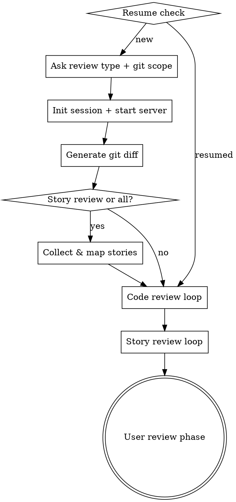
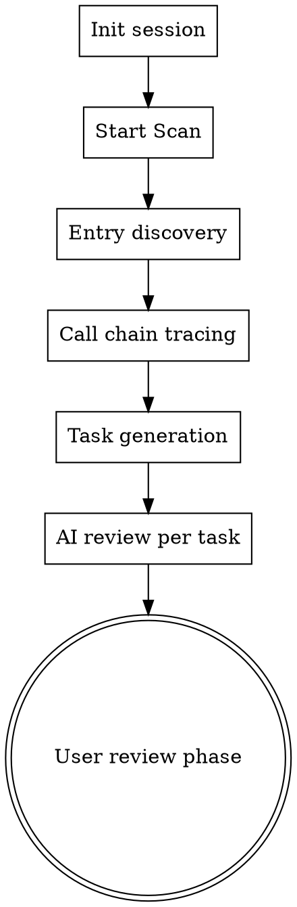

# A-Solid Audit

AI 驱动的代码审查与 Story 对齐审查工具。

[English](README.md)

## 功能亮点

- **AI 代码审查** — 按文件自动分析正确性、代码质量、安全性、错误处理和最佳实践
- **Story 对齐审查** — 将验收标准映射到实际代码变更并评估覆盖度
- **项目扫描** — 从入口点（API 路由、定时任务、消费者、脚本）出发的全量项目扫描，可选集成 [CodeGraph](https://github.com/colbymchenry/codegraph) AST 级调用链分析
- **实时网页报告** — 报告服务器在 AI 审查前自动启动，实时查看进度 `localhost:3456`
- **人工确认与签核** — 确认/驳回发现项（含原因选择），添加备注，签核
- **Story 提供者插件系统** — 可扩展的 Story 提供者（JIRA、Linear 等），通过 `scripts/providers/` 中的脚本实现
- **PDF 导出** — 可配置 PDF 报告导出，包含概览、发现项、代码片段和签核页
- **零依赖** — 纯 Node.js，无需外部包
- **会话恢复** — 恢复中断的会话，重置卡住的任务

## 快速开始

### 前置条件

- 已安装 AI 编程助手 CLI
- Node.js 18+

### 安装插件

本项目是一个通过插件市场分发的 AI 编程助手插件。

**第一步 — 添加市场**

```
/plugin marketplace add a-solid/a-solid-audit
```

或使用完整的 GitHub URL：

```
/plugin marketplace add https://github.com/a-solid/a-solid-audit.git
```

**第二步 — 安装插件**

```
/plugin install a-solid-audit@a-solid-audit-marketplace
```

你也可以使用交互式界面：运行 `/plugin`，进入 **Discover** 标签页，选择插件并以你需要的范围（User、Project 或 Local）安装。

**第三步 — 重载插件**

```
/reload-plugins
```

安装后，`/audit` 技能可在所有项目中使用。

### 使用方法

1. 在 AI 编程助手中打开你的项目：

```bash
cd your-project
claude
```

2. 调用审查技能：

```
/audit
```

3. 按照交互提示操作：
   - 选择审查类型：**代码审查**、**Story 审查**、**项目扫描** 或 **两者**
   - 指定 git 范围：**未提交的更改**、**两个提交** 或 **分支差异**（代码/Story 审查）
   - 项目扫描时：选择目标项目目录

4. AI 代理逐个审查每个文件/Story

5. 查看实时网页报告：

```
http://localhost:3456
```

## 审查流程

### 代码审查 / Story 审查



### 项目扫描



**项目扫描工作原理：**

1. **入口发现** — 通过启发式路径匹配（API handler、定时任务、消息消费者、CLI 脚本）或 [CodeGraph](https://github.com/colbymchenry/codegraph) 框架感知路由检测，扫描项目中的入口点
2. **调用链追踪** — 对每个入口点，追踪调用链到所有关联文件（CodeGraph AST 分析或正则 import 解析）
3. **任务生成** — 每个入口点 + 调用链生成一个独立的审查任务，附带 Mermaid 调用链图
4. **AI 审查** — AI sub-agent 审查每个任务的安全漏洞、业务逻辑缺陷和代码质量问题
5. **用户审查** — 浏览发现项、确认或驳回并填写原因、签核

## 网页报告

报告服务器自动启动，提供分屏界面：

- **概览** — 等级、评分、AI 审查进度、发现项分布、需要关注的事项
- **汇总** — 任务状态表（AI 审查 + 人工确认）、发现项统计、签核表单
- **任务详情** — 按严重度分组的发现项、含原因选择的驳回、代码片段、建议、优点

### 发现项状态生命周期

每个发现项经过以下审查流程：

```
未审查 → 已确认     (点击 Confirm，或进入任务时自动确认)
未审查 → 已推迟     (点击 Dismiss + 选择原因)
```

- **自动确认：** 进入任务详情时，所有未审查的发现项会自动设为已确认
- **术语说明：** UI 按钮显示 "Dismiss"，后端存储值为 `"deferred"`，汇总页面显示 "Deferred"——三者指的是同一个操作

### 驳回原因

| 原因 | 使用场景 |
|---|---|
| False positive | AI 标记了代码中实际不存在的问题 |
| Acceptable risk | 风险已知且当前可接受 |
| Out of scope | 问题超出本次审查范围 |
| Already addressed | 已在其他地方修复 |
| Intentional design | 标记的模式是有意为之的设计决策 |

### 汇总页面指标

| 指标 | 含义 |
|---|---|
| Total Findings | 所有任务的发现项总数 |
| Confirmed | 状态为 `confirmed` 的发现项数量 |
| Action Required | 已确认且严重度为 critical、major 或 high 的发现项数量 |
| Deferred | 状态为 `deferred` 的发现项数量（即被驳回的） |
| Unreviewed | 尚无状态的发现项数量 |

### 人工审查状态

任务表格中显示人工审查列，包含三种状态：

| 状态 | 条件 |
|---|---|
| Reviewed | 任务中所有发现项都已有状态 |
| Partial | 部分发现项已有状态 |
| Unreviewed | 没有发现项有状态 |

### 键盘快捷键

| 按键 | 操作 |
|---|---|
| `←` `→` 或 `J` `K` | 切换任务 |
| `O` | 概览视图 |
| `S` | 汇总视图 |
| `?` | 切换帮助 |

## 技能概览

| 技能 | 描述 |
|---|---|
| **audit** | 编排器 — 管理会话、git diff、任务分发和报告服务 |

编排器使用三个内部 prompt（不注册为独立 skill）：

| Prompt | 描述 |
|---|---|
| **code-review** | 按 5 项标准分析文件差异，输出严重度分级和评分 |
| **story-review** | 评估验收标准覆盖度 |
| **project-review** | 审查入口点调用链的安全性、业务逻辑和代码质量 |

## 会话数据

每次审查会话创建一个 `.audit/<session-id>/` 目录：

```
.audit/
  <session-id>/
    index.yaml              # 会话元数据和任务列表
    code-tasks/
      <path.to.file>.yaml   # 按文件的代码审查任务
    story-tasks/
      <story-name>.yaml     # 按 Story 的对齐审查任务
    project-tasks/
      <entry-name>.yaml     # 按入口点的项目扫描任务
    review-notes.yaml       # 用户备注、确认和签核
```

### 项目扫描任务 YAML

每个项目扫描任务包含：

```yaml
name: "user-management"
type: api                         # api | scheduled | consumer | script | unknown
entry: "src/handlers/users.mjs"   # 入口文件
files:                            # 调用链中所有文件
  - "src/handlers/users.mjs"
  - "src/services/user-service.mjs"
overview:
  diagram: "graph TD\n  ..."      # Mermaid 调用链图
  description: "HTTP API ..."     # 执行流程描述
review:
  score: 7
  findings: [...]
  positives: [...]
```

## 配置

### CodeGraph（可选）

[CodeGraph](https://github.com/colbymchenry/codegraph) 提供 AST 级调用链分析，使项目扫描更精确。未安装时使用启发式 import 解析。

通过内置脚本安装：

```bash
bash scripts/setup-codegraph.sh
```

或手动安装：

```bash
git clone https://github.com/colbymchenry/codegraph.git ~/.local/share/codegraph
cd ~/.local/share/codegraph && npm install && npm run build
npm link
```

### Story 提供者

Story 提供者是 `scripts/providers/` 中的可执行脚本，接收 Story ID 作为参数并输出 JSON 数组：

```json
[{"id": "...", "name": "...", "description": "...", "acceptance": "..."}]
```

如需 JIRA 集成，设置以下环境变量：

| 变量 | 描述 |
|---|---|
| `JIRA_BASE_URL` | JIRA 实例 URL，例如 `https://your-org.atlassian.net` |
| `JIRA_USER_EMAIL` | JIRA 账号邮箱 |
| `JIRA_API_TOKEN` | JIRA API 令牌 |

## 许可证

[Apache License 2.0](LICENSE)
